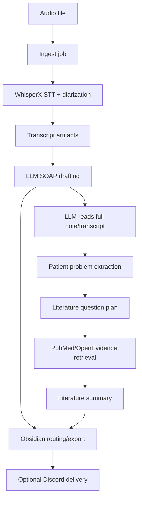

# Ward Pipeline Runtime Minimal

Minimal downloadable version of a local-first clinical audio workflow.

It processes an audio recording into:

1. Transcript and diarization artifacts
2. LLM-assisted SOAP draft
3. LLM-first literature question plan
4. PubMed/OpenEvidence literature summary
5. Obsidian note export
6. Optional Discord delivery

This repository intentionally excludes private launchd jobs, local handoff notes, backups, and machine-specific paths.

## Windows Quick Start

If you are on Windows, do this first:

1. Install Python 3.11 and `ffmpeg`.
2. Open PowerShell in this repo.
3. Run:

```powershell
.\install-windows.ps1
.\deploy-windows.ps1
```

4. Edit `.env` if needed.
5. Check the setup:

```powershell
.\.venv\Scripts\python.exe ward_cli.py config
```

6. Process one audio file:

```powershell
.\.venv\Scripts\python.exe ward_cli.py process C:\path\to\audio.m4a
```

7. For continuous monitoring:

```powershell
.\.venv\Scripts\python.exe ward_cli.py watch-incoming --incoming-dir C:\path\to\incoming
```

Chinese quick start:

- [`docs/快速上手.md`](docs/快速上手.md)

## Requirements

- macOS, Linux, or Windows
- Python 3.11
- `ffmpeg`
- Codex CLI available as `codex` if using `--allow-external-llm`
- Hugging Face token for WhisperX diarization
- Optional Discord bot token for Discord delivery

On macOS or Linux:

```bash
./install.sh
```

On Windows:

```powershell
.\install-windows.ps1
```

## Install

Then edit `.env`:

```bash
HF_TOKEN=...
NCBI_API_KEY=...
DISCORD_BOT_TOKEN=...
OBSIDIAN_VAULT_DIR=/path/to/your/Obsidian/Vault
```

Check resolved config:

```bash
.venv/bin/python ward_cli.py config
```

On Windows:

```powershell
.\.venv\Scripts\python.exe ward_cli.py config
```

## Run One Audio File

Basic run:

```bash
.venv/bin/python ward_cli.py process /path/to/audio.m4a
```

On Windows:

```powershell
.\.venv\Scripts\python.exe ward_cli.py process C:\path\to\audio.m4a
```

Full run with LLM, literature, Obsidian export, and Discord delivery:

```bash
.venv/bin/python ward_cli.py process /path/to/audio.m4a \
  --allow-external-llm \
  --export-obsidian \
  --deliver-target discord:DISCORD_CHANNEL_ID
```

On Windows:

```powershell
.\.venv\Scripts\python.exe ward_cli.py process C:\path\to\audio.m4a `
  --allow-external-llm `
  --export-obsidian `
  --deliver-target discord:DISCORD_CHANNEL_ID
```

Outputs are written under:

```text
data/output/<job_id>/
```

Important files:

- `raw_transcript.txt`
- `transcript.speaker.txt`
- `soap_note.md`
- `classification.json`
- `literature_question_plan.json`
- `literature_summary.json`
- `delivery.report.json`

## Workflow V2

The current workflow does not let taxonomy drive literature search first.

Execution order:



Design rule:

- LLM literature planning reads the full clinical content first.
- Taxonomy is a fallback, not the primary source of literature questions.
- Unknown specialties should not be forced into an incorrect folder.
- Clinician review is required before using generated text clinically.

## OpenEvidence

Default mode uses browser automation:

```env
WARD_OPENEVIDENCE_PROVIDER=browser
```

Login once:

```bash
.venv/bin/python ward_cli.py openevidence-login --timeout 300
```

If you do not want OpenEvidence, PubMed retrieval can still run where supported.

## Obsidian

Set:

```env
OBSIDIAN_VAULT_DIR=/path/to/your/Obsidian/Vault
```

Then use:

```bash
.venv/bin/python ward_cli.py export-obsidian latest
```

or include `--export-obsidian` during `process` or `run`.

## Discord

Set:

```env
DISCORD_BOT_TOKEN=...
```

Use:

```bash
--deliver-target discord:DISCORD_CHANNEL_ID
```

The bot must have permission to post in that channel.

## Repository Layout

- `ward_cli.py`: command-line entrypoint
- `ward_pipeline/`: core workflow code
- `taxonomy/`: taxonomy and routing data
- `tests/`: regression tests
- `.env.example`: local configuration template
- `requirements.txt`: Python dependencies

## 中文快速上手

- [`docs/快速上手.md`](docs/快速上手.md)

## Tests

```bash
.venv/bin/python -m pytest
```

For a light syntax check without installing full STT dependencies:

```bash
python3.11 -m compileall ward_cli.py ward_pipeline taxonomy
```

## Security

Do not commit:

- `.env`
- tokens
- OpenEvidence browser sessions
- generated patient outputs in `data/`

This minimal repo is intended as a starting point for another local installation, not as a hosted clinical service.
